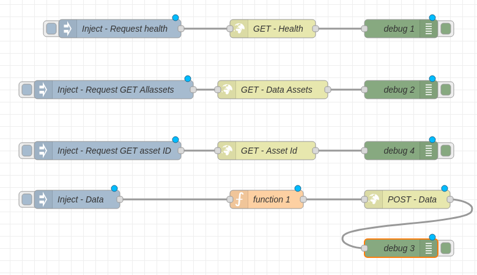

# Offloading-de-Dados-IoT-para-Blockchain

  

O seguinte projeto engloba interação de dispositivos IoT com a tecnologia Blockchain, com o objetivo de armazenar dados em uma rede descentralizada. Para isso foram utilizadas as ferramentas Node-Red e Hyperledger Fabric. Os scripts de conexão e interação com a rede foram feitos utilizando JavaScript com Node.js. Além disso, para emitir mensagens na rede foi utilizado o Node-RED. 


## Pré-requisitos
Para fazer a rede blockchain funcionar é necessária a instalação do Hyperledger Fabric. Para isso, siga o tutorial disponível em: https://hyperledger-fabric.readthedocs.io/en/release-2.5/install.html. Após a instalação do Hyperledger Fabric, é necessário localizar a pasta `fabric-samples` que é gerada após a instalação do Hyperledger Fabric para mudar os path no script  *configuracaoenv.js* . Após isso, execute os comandos do setupScript.sh para configurar a rede, o canal, chaincode e variaveis de ambiente dentro do diretório `fabric-samples/test-network`. Por fim, faça a instalação do node-red o qual será utilizado para emitir mensagens na rede. Para isso, siga o tutorial disponível em: https://nodered.org/docs/getting-started/local.

## Instalação

Baixe o projeto com o comando abaixo ou faça o download do projeto:
```
git clone https://github.com/janaina-sudo/Offloading-de-Dados-IoT-para-Blockchain.git
```


## Execução
Para executar o servidor que faz a interação da rede blockchain com o Node-RED, execute o comando `npm start` dentro da pasta do projeto. Para executar o Node-RED, execute o comando `node-red` em outro terminal. Ademais, Acesse o endereço `http://localhost:1880/` e importe o arquivo `flows.json` que está na pasta deste projeto. Após isso, é possível visualizar o seguinte fluxo na imagem abaixo:



Logo, é possível enviar mensagens para a rede blockchain. Para isso, basta clicar no componente `inject` para realizar a requisição. Após isso, é possível visualizar a resposta da requisição no componente `debug`. Lembre-se de que é necessário que o servidor esteja rodando para que a interação com a rede blockchain seja realizada. 

## Ferramentas
- Node-RED
- Hyperledger Fabric
- Node.js
- JavaScript
- Express


## Autores
- Janaina Ribeiro
- Matheus Sousa 
- Matheus Vieira